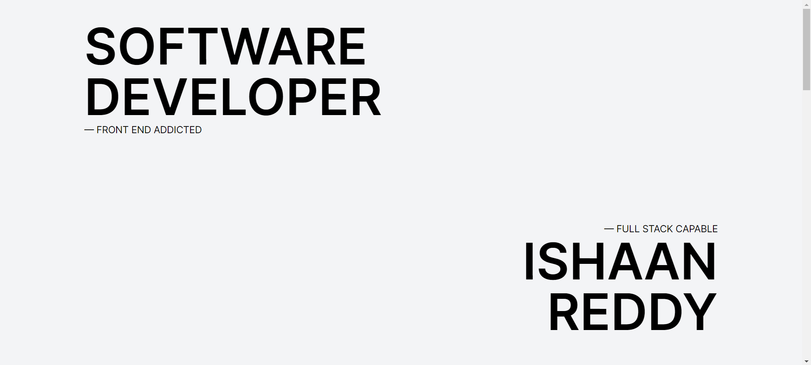
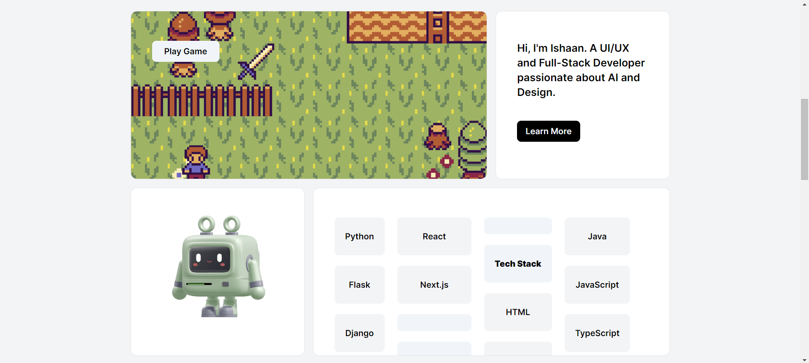
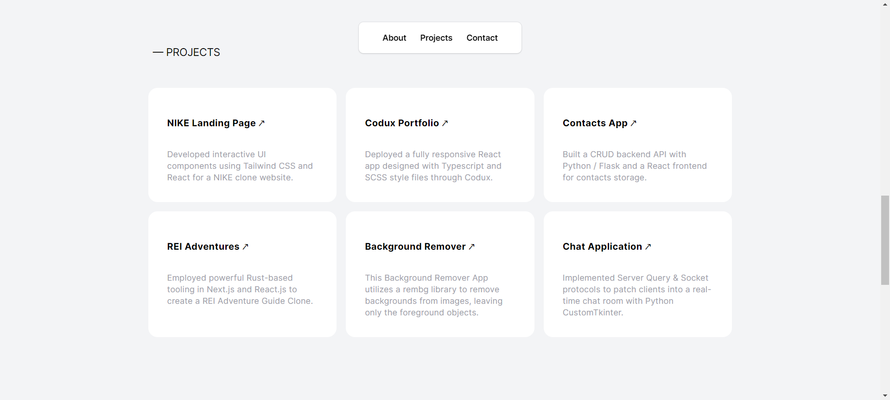
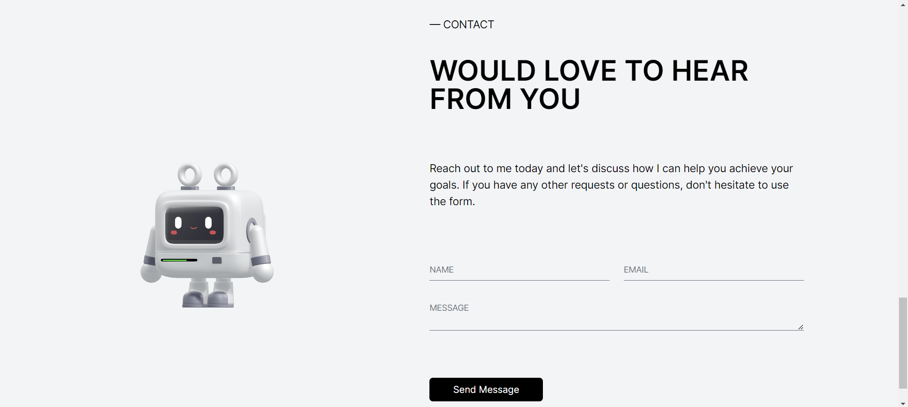

# Spline Portfolio

Welcome to the Spline Portfolio repository! This project showcases a creative portfolio built using Spline, an innovative 3D design tool for the web and Aceternity UI. This is also a [Next.js](https://nextjs.org/) project bootstrapped with [`create-next-app`](https://github.com/vercel/next.js/tree/canary/packages/create-next-app).

## Features

- **Interactive 3D Design**: Engage visitors with a 3D portfolio experience.
- **Responsive Layout**: Optimized for various screen sizes and devices.
- **Smooth Animations**: Enhance user experience with smooth Aceternity UI transitions and animations.

## Demo

